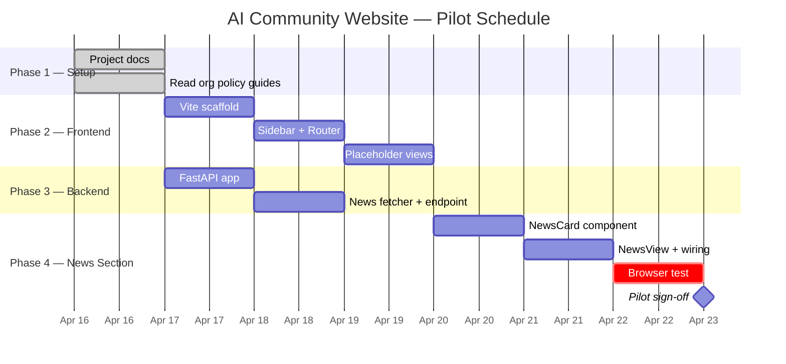

# PROJECT.md — AI Community Website

> Follows PMBOK 7th Edition structure. Maintained by Claude Code throughout the project lifecycle.

---

## Project Identification

| Field | Value |
|---|---|
| **Project Name** | AI Community Website |
| **Project ID** | DEWA-2026-AIC |
| **Project Manager** | Saravanakumar S |
| **Sponsor / Owner** | DEWA AI Community |
| **Start Date** | 2026-04-16 |
| **Planned End Date** | TBD |
| **Status** | Phase 1 Complete — Phase 2 Planning |
| **Last Updated** | 2026-04-19 |
| **Repository** | C:\Users\DELL\Documents\AI Community |

---

## Key Performance Indicators

| KPI | Current | Target | Status |
|---|---|---|---|
| Sections live | 7 | 6 | ✅ Exceeded |
| News articles displayed | 15 (5 categories × 3) | 12 | ✅ Exceeded |
| Pages with real content | 7 | 5 | ✅ Exceeded |
| Daily quiz questions | 5 per day | 5 | ✅ Met |
| News refresh interval | 30 min (backend scheduler) | On page load | ✅ Exceeded |

---

## Contents

1. [Project Charter](#1-project-charter)
2. [Scope Statement](#2-scope-statement)
3. [Work Breakdown Structure](#3-work-breakdown-structure-wbs)
4. [Schedule & Milestones](#4-schedule--milestones)
5. [Deliverables Register](#5-deliverables-register)
6. [Cost Management](#6-cost-management)
7. [Risk Register](#7-risk-register)
8. [Issue Log](#8-issue-log)
9. [Change Log](#9-change-log)
10. [Lessons Learned](#10-lessons-learned)
11. [Current Status & Next Steps](#11-current-status--next-steps)

---

## 1. Project Charter

### 1.1 Project Purpose

To create an AI Community website for DEWA AI enthusiasts that serves as a central hub for intuitive, easy-to-understand information about the department's AI adoption initiatives, daily AI news, and the latest advancements in the field. The site will also showcase leaderboards, recognitions, and upcoming events to increase engagement, awareness, and visibility across the organization.

### 1.2 Business Objectives

- Provide a central hub for DEWA AI enthusiasts with curated, easy-to-understand AI content
- Deliver daily live AI news covering Claude, AI Agents, and quick tips for practical adoption
- Showcase DEWA's AI adoption journey through leaderboards and recognitions
- Increase organizational engagement and awareness of AI initiatives via events and announcements
- Improve visibility of the department's AI progress across the organization

### 1.3 Key Stakeholders

| Role | Name / Team | Interest |
|---|---|---|
| Project Manager | Saravanakumar S | Delivery and quality |
| End Users | DEWA AI enthusiasts & staff | Relevant AI content, events, recognition |
| Sponsor | DEWA AI Community leadership | Visibility, adoption, engagement |
| Technical Lead | Claude Code (AI assistant) | Architecture, code quality |

### 1.4 Success Criteria

- AI News section displays live news on page load (no stale or hardcoded content)
- All 6 navigation sections accessible (5 placeholders + 1 live for pilot)
- Design is intuitive and presentation-ready — sidebar-first, warm neutrals, dark green accent
- Leaderboard, events, and announcements sections are structured for future content
- Page loads cleanly with no console errors

### 1.5 Assumptions & Constraints

| Type | Statement |
|---|---|
| Assumption | news-aggregator-mcp-server remains connected and available |
| Assumption | No authentication required for pilot |
| Constraint | No database — news fetched live on page load for pilot |
| Constraint | Images deferred to post-pilot phase |
| Constraint | Pilot covers AI News section only — other sections are placeholders |

---

## 2. Scope Statement

### 2.1 In Scope

| Work Package | Description |
|---|---|
| WP1: Site Shell | Vue 3 + Vite app with sidebar nav, Vue Router, 6 routes |
| WP2: AI News Section | Live news cards — Claude (4), AI Agents (4), Quick Tips (4) |
| WP3: FastAPI Backend | Single `/api/news` endpoint fetching from news-aggregator-mcp-server |
| WP4: Project Docs | PROJECT.md, CONVENTIONS.md, CLAUDE.md |

### 2.2 Out of Scope (Pilot)

- User authentication / login
- Images on news cards (deferred)
- About Us, Vision, Leaderboard, Events, Announcements content (placeholders only)
- Auto-refresh / real-time updates (on page load only for pilot)
- Database or persistent storage
- Deployment / hosting

### 2.3 Acceptance Criteria (Definition of Done)

- Vue Router serving all 6 routes without 404
- AI News page loads 12 articles (4 per category) from live MCP data
- Fallback triggers correctly when Claude articles < 2 in category feed
- EZ Design System applied — no pure black/white, sidebar present, correct fonts
- `npm run dev` starts without errors
- FastAPI `/api/health` returns `{"status": "ok"}`

---

## 3. Work Breakdown Structure (WBS)

| WBS # | Work Package / Task | Description | Owner | Status |
|---|---|---|---|---|
| 1.0 | **Project Setup** | Scaffold, docs, config | Claude Code | ✅ Complete |
| 1.1 | Create CLAUDE.md | Project instructions | Claude Code | ✅ Complete |
| 1.2 | Create PROJECT.md | PMBOK project log | Claude Code | ✅ Complete |
| 1.3 | Create CONVENTIONS.md | Naming & structure rules | Claude Code | ✅ Complete |
| 1.4 | Read org policy .md files | stack, design, api-patterns | Claude Code | ✅ Complete |
| 2.0 | **Frontend Scaffold** | Vue 3 + Vite + Router setup | Claude Code | ✅ Complete |
| 2.1 | Init Vite project | npm create vite frontend | Claude Code | ✅ Complete |
| 2.2 | Install Vue Router | vue-router@4 | Claude Code | ✅ Complete |
| 2.3 | Import EZ Design System | DEWA colour system, Space Grotesk + DM Sans | Claude Code | ✅ Complete |
| 2.4 | Build App.vue + Sidebar | Grouped nav cards, per-icon colours, mobile responsive | Claude Code | ✅ Complete |
| 2.5 | Create 7 route views | All sections live with real content | Claude Code | ✅ Complete |
| 3.0 | **Backend** | FastAPI + SQLite + APScheduler | Claude Code | ✅ Complete |
| 3.1 | Init FastAPI app | app.py, CORS, /api/health | Claude Code | ✅ Complete |
| 3.2 | News fetcher + 5 categories | RSS-based, 30-min scheduler, sanitisation | Claude Code | ✅ Complete |
| 3.3 | Daily Quiz backend | quiz_db.py, quiz_routes.py, 5 questions/day | Claude Code | ✅ Complete |
| 4.0 | **AI News Section** | NewsView + NewsCard — 5 categories | Claude Code | ✅ Complete |
| 5.0 | **Daily Quiz** | Email gate, 5 questions, results, leaderboard | Claude Code | ✅ Complete |
| 6.0 | **Events** | EventsView + EventsList home widget | Claude Code | ✅ Complete |
| 7.0 | **Announcements** | Course announcement — Udemy AI Coder course | Claude Code | ✅ Complete |
| 8.0 | **Leader's Message** | CAIO + AI Adoption Head — two-column layout | Claude Code | ✅ Complete |
| 9.0 | **About Us** | Team description, focus areas, contact | Claude Code | ✅ Complete |
| 10.0 | **Phase 2 — TBD** | Adoption journey visibility, recognition features | TBD | 🔜 Planned |

---

## 4. Schedule & Milestones

**Planned Duration:** 2026-04-16 — TBD
**Actual Duration:** 2026-04-16 — ongoing

### 4.1 Milestone List

| Date | Milestone | Description | Status |
|---|---|---|---|
| 2026-04-16 | Project Initiation | CLAUDE.md, PROJECT.md, CONVENTIONS.md created | ✅ Complete |
| 2026-04-16 | Frontend Shell Live | All 7 routes working, sidebar nav functional | ✅ Complete |
| 2026-04-16 | AI News Live | 15 live articles across 5 categories, 30-min backend refresh | ✅ Complete |
| 2026-04-17 | Daily Quiz Live | Email-gated quiz, 5 questions/day, results panel, scheduler | ✅ Complete |
| 2026-04-18 | Events & Announcements Live | Events from JSON, Udemy course announced | ✅ Complete |
| 2026-04-19 | Leader's Message & About Us Live | CAIO + AI Adoption Head messages, team description | ✅ Complete |
| 2026-04-19 | Phase 1 Complete | All sections live, design consistent, community hub functional | ✅ Complete |
| TBD | Phase 2 Kickoff | Adoption journey visibility, recognition features, community signals | 🔜 Planned |

### 4.2 Gantt Chart

---

## 5. Deliverables Register

| ID | Deliverable | Location | Format | Owner | Status |
|---|---|---|---|---|---|
| D1 | CLAUDE.md | /CLAUDE.md | Markdown | Claude Code | [Delivered] |
| D2 | PROJECT.md | /PROJECT.md | Markdown | Claude Code | [Delivered] |
| D3 | CONVENTIONS.md | /CONVENTIONS.md | Markdown | Claude Code | [In Progress] |
| D4 | Frontend App | /frontend/ | Vue 3 + Vite | Claude Code | [Planned] |
| D5 | Backend API | /backend/ | FastAPI | Claude Code | [Planned] |
| D6 | AI News Section | /frontend/src/views/NewsView.vue | Vue SFC | Claude Code | [Planned] |

---

## 6. Cost Management

### 6.1 One-Time Costs

| Activity | Category | Cost | Basis |
|---|---|---|---|
| news-aggregator-mcp-server pip install | Setup | $0 | Free |
| uv pip install | Setup | $0 | Free |
| **Total one-time** | | **$0** | |

### 6.2 Recurring Costs

| Component | Frequency | Per-period Cost | Monthly Estimate |
|---|---|---|---|
| news-aggregator-mcp-server | per page load | $0 | $0 |
| Claude Code API usage | per session | ~$0.05–$0.10 | Minimal |
| **Monthly total** | | | **~$0–$5** |

---

## 7. Risk Register

| ID | Risk Description | Impact if Realized | Likelihood | Severity | Mitigation | Status |
|---|---|---|---|---|---|---|
| R1 | AI category feed returns no Claude-specific articles | Claude section empty | Medium | Medium | Two-layer fetch — fallback to search_global_news | [Monitoring] |
| R2 | news-aggregator-mcp-server disconnects | No news data | Low | High | Health check on /api/news; surface error clearly in UI | [Open] |
| R3 | EZ Design System tokens not found at ~/design-system | Styling fails | Low | Medium | Copy tokens locally into project on scaffold | [Open] |

---

## 8. Issue Log

| ID | Date Raised | Issue | Impact | Resolution | Status |
|---|---|---|---|---|---|
| I1 | 2026-04-16 | settings.local.json had `//c/` path prefix | Permission rule not recognised | Changed to `C:/` format | [Resolved] |

---

## 9. Change Log

| ID | Date | Change | Reason | Impact | Approved By |
|---|---|---|---|---|---|
| C1 | 2026-04-16 | Images deferred to post-pilot | Focus on content first | AI News cards have no images in pilot | Saravanakumar S |
| C2 | 2026-04-16 | Refresh on page load only | Simplicity for pilot | No polling or websocket needed | Saravanakumar S |
| C3 | 2026-04-16 | Added SQLite 30-day archive + 4-hour scheduler | User requested daily news repository | Added database.py, scheduler.py; no Docker needed for pilot | Saravanakumar S |
| C4 | 2026-04-16 | Expanded from 3 to 5 news categories | Broader AI coverage — Copilot, advancements, workplace tools | Added ai-at-work and advancements categories; updated fetcher, API, frontend | Saravanakumar S |

---

## 10. Lessons Learned

| Date | Category | Lesson | Recommendation |
|---|---|---|---|
| 2026-04-16 | Process | Planning token consumption upfront saved context waste | Always estimate tokens before multi-step fetch tasks |
| 2026-04-16 | Process | Step-by-step approval keeps user informed and in control | Apply brief → approve → execute in every session |
| 2026-04-16 | Architecture | news-aggregator was already configured — check `claude mcp list` first | Always verify existing MCP config before attempting to add |
| 2026-04-19 | Product | Sensitive data (division adoption rates) removed early saved rework and trust issues | Discuss data sensitivity before building, not after |
| 2026-04-19 | Design | Per-page accent colours via CSS variables avoided prop drilling and kept components reusable | Use CSS custom properties for theme variation across pages |
| 2026-04-19 | Scope | Site evolved from adoption-metrics-first to community-hub-first — a better fit for the audience | Start with what you can deliver with confidence; layer complexity in Phase 2 |
| 2026-04-19 | Content | Leader messages and About Us gave the site a human voice it was missing | Always include identity content alongside functional features |

---

## 11. Current Status & Next Steps

### 11.1 Current Status (as of 2026-04-19)

> **Phase 1 Complete** — All sections are live, the site is functional, and the community hub is delivering value to DEWA employees from day one.
>
> The platform launched with more capability than originally scoped — 7 live sections, a fully automated daily quiz, 30-minute news refresh, DEWA-branded design system, and authentic leadership content. The team took deliberate, considered decisions throughout (including the responsible choice to defer sensitive adoption data to Phase 2 rather than rush it out).

### 11.2 Phase 1 Achievements

| Section | Outcome |
|---|---|
| 🏠 Home | Hero, quiz strip, live news preview, events widget — all in one view |
| 📰 AI News | 5 categories, 15 live articles, 30-min auto-refresh via backend scheduler |
| 🧠 Daily Quiz | Email-gated, 5 daily questions, automated publish at 00:01, results panel |
| 📅 Events | Live events page + home widget from shared JSON source |
| 📣 Announcements | First course published — Udemy AI Coder programme |
| 💬 Leader's Message | CAIO + AI Adoption Department Head messages, side-by-side layout |
| ℹ️ About Us | Team purpose, focus areas, contact information |

### 11.3 Phase 2 Scope (Planned)

| # | Initiative | Notes |
|---|---|---|
| 1 | AI adoption journey visibility | Replace dropped division data with a meaningful, non-sensitive representation of DEWA's AI progress |
| 2 | Recognition features | Acknowledge active community participants, quiz champions, AI champions across departments |
| 3 | Community signals | Surface aggregate stats (quiz attempts, participation rates) to reinforce the community feeling |
| 4 | Content expansion | Grow quiz question bank beyond 20, add more announcements, richer events |
| 5 | Business user input | Gather feedback from DEWA employees to prioritise next components |

### 11.4 Technology Stack

| Layer | Technology | Version / Notes |
|---|---|---|
| Frontend | Vue 3 + Vite + Vue Router | Latest |
| Backend | FastAPI + Uvicorn | Python 3.14 |
| Database | None | No persistence needed for pilot |
| Styling | EZ Design System | ~/design-system/index.css |
| News Data | news-aggregator-mcp-server | Installed, Connected |
| Infrastructure | None (local dev only) | No Docker for pilot |

### 11.5 Architecture Decisions

| Date | Decision | Rationale | Alternatives Considered |
|---|---|---|---|
| 2026-04-16 | No database for pilot | News fetched live — no persistence needed | SQLite (rejected: unnecessary complexity) |
| 2026-04-16 | Two-layer fetch (category → fallback search) | Saves tokens; fallback only when needed | Always search (rejected: wastes tokens) |
| 2026-04-16 | Refresh on page load only | Simplest approach for pilot | Auto-refresh polling (deferred to later) |
| 2026-04-16 | Images deferred | Content first; image sourcing adds complexity | OG image fetch (deferred to post-pilot) |
